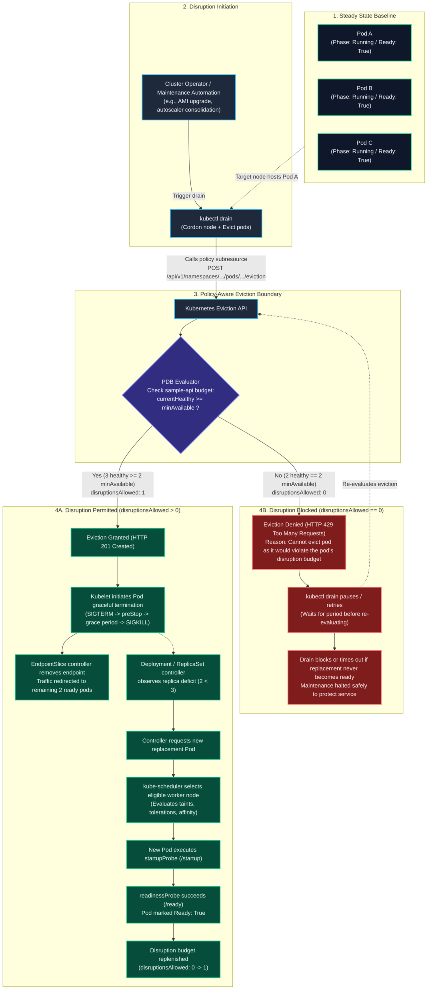

# Planned Disruption Flow & Eviction Architecture

This architecture document visualizes the control flow of **voluntary disruptions** in Kubernetes, detailing how the **Eviction API** interacts with `PodDisruptionBudget` (PDB) during planned maintenance operations (such as `kubectl drain`), and establishing strict boundaries with rollout controllers and involuntary failures.

A foundational reliability principle in Kubernetes is:

$$
\text{PodDisruptionBudget} \ne \text{Application High Availability}
$$

A PodDisruptionBudget defines how much voluntary disruption an already resilient workload can tolerate. It does **not** create application availability by itself.

---

## Control Plane Planned Disruption Flow

The following sequence models the control flow when an operator or automated system (e.g., node auto-drain, Karpenter/Cluster Autoscaler node consolidation, AWS AMI rotation) drains a node:



---

## Architectural Boundaries

To operate production Kubernetes clusters reliably, platform engineers must separate four distinct disruption and lifecycle boundaries:

| Mechanism | API Layer | Governed by PDB? | Behavior During Involuntary Crash | Primary Constraint Mechanism |
| :--- | :--- | :--- | :--- | :--- |
| **Voluntary Policy-Aware Eviction** (`kubectl drain`, Karpenter, Cluster Autoscaler) | **Eviction API** (`/v1/pods/{name}/eviction`) | **YES** | N/A (Voluntary operation) | Respects `spec.minAvailable` / `spec.maxUnavailable`. Denied with HTTP 429 if budget is exhausted. |
| **Direct Pod Deletion** (`kubectl delete pod <name>`) | **Core Pod API** (`/api/v1/namespaces/{ns}/pods/{name}`) | **NO** | N/A (Immediate deletion request) | Bypasses Eviction API completely. The pod is deleted regardless of PDB status. |
| **Deployment Rolling Update** (`kubectl set image`, GitOps rollout) | **Workload Controller** (`apps/v1` ReplicaSet controller) | **NO** | N/A (Rollout lifecycle) | Governed exclusively by `spec.strategy.rollingUpdate.maxUnavailable` and `maxSurge`. Deployment controller does not call the Eviction API. |
| **Involuntary Disruption** (Hardware loss, kernel crash, OOM, power failure) | **Physical / Node Infrastructure** | **NO** | Immediate loss of node/pod | PDB cannot prevent physical failure. However, the loss **consumes the disruption budget**, reducing `disruptionsAllowed` to 0. |

---

## Disruption Arithmetic for `sample-api`

In this reference architecture, the workload configuration is:

- `spec.replicas`: **3**
- `spec.minAvailable`: **2**
- `spec.unhealthyPodEvictionPolicy`: **AlwaysAllow**

### Scenario 1: Steady State (All 3 Replicas Ready)
- `desiredHealthy`: 2
- `currentHealthy`: 3
- `disruptionsAllowed`: **1**
- **Result:** Draining a node hosting 1 replica succeeds immediately.

### Scenario 2: During Replacement Warm-Up (Pod A terminating, Pod Replacement starting)
- `desiredHealthy`: 2
- `currentHealthy`: 2 (Pod B and Pod C only)
- `disruptionsAllowed`: **0**
- **Result:** A concurrent attempt to drain the node hosting Pod B is **rejected** with HTTP 429 (`DisruptionAllowed: False`, reason: `InsufficientPods`).

### Scenario 3: Broken Pod (Pod A failing readiness or crashing)
- With `unhealthyPodEvictionPolicy: AlwaysAllow`:
  - Pod A (unhealthy) can be evicted during node drain even if `disruptionsAllowed` is 0.
  - This prevents a broken application replica from permanently halting cluster-wide node upgrades or security patching.

---

## Reliability Progression: Milestone Bridge

The platform reliability story builds across three deliberate milestones:

```text
#21 — Readiness (Workload Probes)
"Can this specific replica serve traffic?"
└── Decouples running state from ready backend routing.

            ↓

#22 — Disruption Budget (PDB)
"How much voluntary disruption can this workload tolerate simultaneously?"
└── Protects serving capacity during planned maintenance via the Eviction API.

            ↓

#23 — Topology Resilience (Topology Spread Constraints)
"Where should replicas run across failure domains (nodes & zones)?"
└── Guarantees pods are not concentrated on a single failure domain.
```

> [!NOTE]
> A PDB ensures **numerical availability** during planned maintenance; it does **not** ensure failure domain distribution. Even with a perfect PDB, if all 3 replicas are scheduled onto the same underlying rack or Availability Zone, a single infrastructure loss will impact the entire service. Milestone #23 addresses topology distribution.
