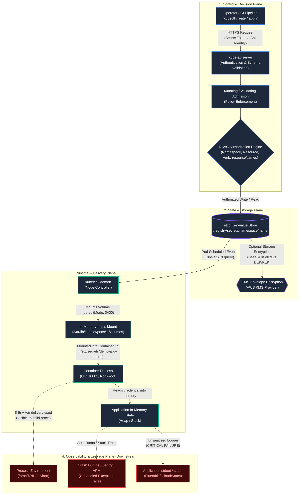
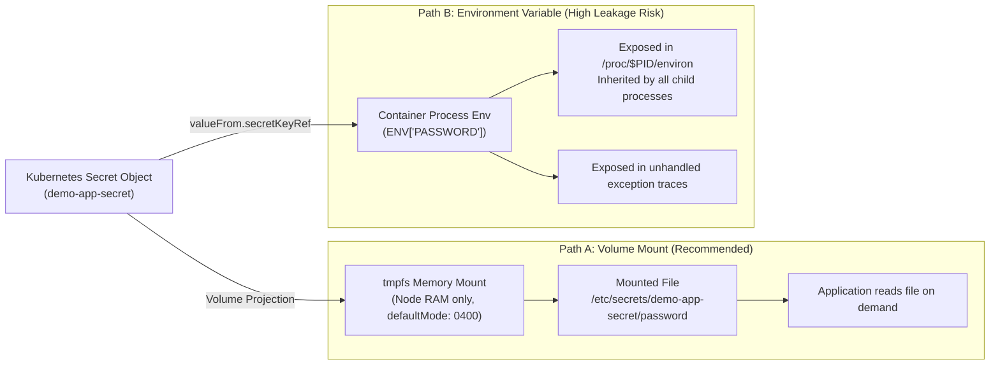

# Secret Trust-Boundary & Delivery Architecture

Base64 encoding is representation, not confidentiality.

Encoding an arbitrary byte array into ASCII via RFC 4648 allows binary credentials to traverse JSON/YAML serialization without corrupting delimiters. It provides zero cryptographic protection, zero access control, and zero authenticity verification.

A secure secret platform requires answering five concrete system questions:
1. Who can retrieve the secret from the control plane?
2. Where and how is the secret stored at rest?
3. How does the secret reach the compute node and container runtime?
4. Where can the secret leak across runtime boundaries?
5. How is the secret rotated or revoked when compromised?

```text
Secret Source
     ↓
Kubernetes API (Authentication & Admission)
     ↓
Authorization (RBAC Evaluation)
     ↓
Persistent Storage (etcd Data Plane)
     ↓
Node Delivery (kubelet tmpfs Mount)
     ↓
Container Runtime (Process Isolation)
     ↓
Application Consumption (In-Memory Reference)
     ↓
Potential Output Boundaries (Logs, Traces, Core Dumps)
```

Each step transition forms an independent trust boundary. Hardening one layer does not protect against a failure in another.

> [!NOTE]
> **Evidence Status: DESIGNED / ILLUSTRATIVE**
> The system planes, RBAC policies, and delivery pathways described below illustrate Kubernetes native secret mechanics. Concrete manifests are verified statically in [`kubernetes/workloads/secret-demo/`](../../kubernetes/workloads/secret-demo/). Cloud-provider etcd envelope encryption is documented at the architectural boundary and classified as DESIGNED / DOCUMENTED.

---

## The Four Architectural Planes



---

## Trust Boundary 1: Storage at Rest (etcd)

A Kubernetes Secret object is not inherently encrypted storage.

```text
Base64 Encoding ≠ Encryption
Secret API Object ≠ Guaranteed Encrypted-at-Rest Storage
```

1. **Vanilla etcd Behavior:** By default, `kube-apiserver` writes Secret payloads into etcd as Base64-encoded strings wrapped in Protocol Buffers. Anyone with direct read access to the etcd volume, an unencrypted etcd backup snapshot, or a compromised etcd peer endpoint can extract every plaintext credential across the entire cluster.
2. **Envelope Encryption (AWS KMS / EKS):** To achieve confidentiality at rest, the control plane must configure an `EncryptionConfiguration` provider referencing an external key management service (such as AWS KMS). In this model:
   - A local Data Encryption Key (DEK) encrypts the Secret before writing to etcd.
   - A Key Encryption Key (KEK) managed in AWS KMS encrypts the DEK.
3. **Repository Status:** Because this repository implements workload-layer configurations and does not provision AWS KMS infrastructure in Milestone #25, etcd encryption at rest is classified as **DESIGNED / DOCUMENTED**, not runtime-observed.

---

## Trust Boundary 2: Authorization & Retrieval (RBAC)

A secret is exposed if an identity receives authority to retrieve it from the Kubernetes API.

Kubernetes RBAC enforces authorization based on three dimensions:
- **Namespace:** Boundaries isolate objects between projects and teams.
- **Verbs:** Distinguish `get` (single object retrieval) from `list` and `watch` (collection-wide enumeration).
- **Resource Names (`resourceNames`):** Restricts direct retrieval to explicitly named Secret objects.

```yaml
# Least-Privilege Role: Exact resource target and single verb
apiVersion: rbac.authorization.k8s.io/v1
kind: Role
metadata:
  name: secret-reader-role
  namespace: sample-workloads
rules:
  - apiGroups: [""]
    resources: ["secrets"]
    resourceNames: ["demo-app-secret"]
    verbs: ["get"]
```

### The `resourceNames` Authorization Semantic Boundary

| Operation | `resourceNames: ["demo-app-secret"]` Supported? | Behavioral Impact |
| :--- | :--- | :--- |
| `get` | **Yes** | Allows `kubectl get secret demo-app-secret -o yaml`. |
| `update` / `patch` | **Yes** | Allows modifying only the specified Secret. |
| `delete` | **Yes** | Allows deleting only the specified Secret. |
| `create` | **No** | Creation requests evaluate before the object name exists in storage. Scoping `create` requires admission webhooks. |
| `list` | **No** | Collection-level requests. If a role specifies `resourceNames`, `kubectl get secrets` returns **HTTP 403 Forbidden**. |
| `watch` | **No** | Watch requests open stream on the collection. Cannot be filtered by `resourceNames` in RBAC. |

Granting `list` or `watch` permissions on `secrets` allows an identity to scrape metadata and contents of every secret in the namespace. Least-privilege consumers should only receive `get` on their designated secret name.

### Direct vs. Indirect Secret Access Boundary
- **Direct API Boundary:** Governed by Kubernetes RBAC. Restricting `secrets` `get`/`list` prevents an identity from querying Secret objects directly.
- **Kubelet Volume Mount Boundary:** Kubelet retrieves Secrets using node authorization. A workload Pod does not need Secret RBAC to mount a Secret volume.
- **Indirect Access Boundary:** If an identity can create Pods (`pods/create`, `deployments/create`) in a namespace, it can schedule a Pod that mounts and outputs any Secret in that namespace, bypassing Secret RBAC unless restricted by admission control policies (e.g., Kyverno or OPA/Gatekeeper).

---

## Trust Boundary 3: Workload Delivery (Volume Mount vs. Environment Variables)

Once the Pod is scheduled, `kubelet` retrieves the Secret from the API server and delivers it to the container. Kubernetes provides two primary mechanisms:



### Trade-Off Matrix: Volume Mount vs. Environment Variable

| Evaluation Criterion | Secret Volume Mount | Environment Variable |
| :--- | :--- | :--- |
| **Storage Medium** | In-memory `tmpfs` (never touches node physical disk). | Host/container process memory table. |
| **File Permissions** | Enforced via `defaultMode: 0400` (readable only by process owner). | Ineffective; any process running as the same UID can read `/proc/$PID/environ`. |
| **Child Process Leakage** | Child processes do not automatically open the file. | Child processes (`sh`, helper binaries, debugging tools) inherit full environment by default. |
| **Crash & Error Reporting** | Error logging frameworks rarely dump arbitrary file contents. | Sentry, APM, and panic traces frequently dump process environment variables into external logging systems. |
| **Dynamic Rotation** | Kubelet automatically updates directory symlinks (`..data`) when Secret changes. *(Note: Volume mounts using `subPath` do NOT update).* | **Frozen at process startup.** Updating the Secret never changes environment of a running process. |

---

## Trust Boundary 4: Application Consumption & Rotation Lifecycle

Even when delivered securely via a volume mount on `tmpfs`, the application runtime introduces two critical failure modes:

```text
Secret Safely Stored ≠ Secret Safely Handled by Application
Secret Updated in Kubernetes ≠ Secret Updated in Application Memory
```

### 1. In-Memory Staleness Trap
1. Kubelet observes a Secret update via periodic sync or watch.
2. Kubelet creates a new timestamped directory on `tmpfs` containing updated secret files.
3. Kubelet updates the `..data` symlink atomically pointing to the new directory.
4. **The Application Failure:** If the application read the file into an in-memory variable during startup (`this.password = readFile(...)`), the application process never re-reads the filesystem. It continues executing with the revoked credential until manually restarted via `kubectl rollout restart`.

### 2. Downstream Leakage Channels
- **Application stdout/stderr:** Printing request context, database connection strings, or debug flags.
- **Diagnostic Endpoints:** Unauthenticated `/debug/pprof`, Spring Boot `/actuator/env`, or health endpoints exposing configuration.
- **Shell History:** Operators running manual commands (`curl -u admin:$PASS`) inside container shells.

---

## Trust Boundary 5: Immutable Secrets (`immutable: true`)

Kubernetes v1.21+ supports marking a Secret as immutable:

```yaml
apiVersion: v1
kind: Secret
metadata:
  name: demo-app-secret-v1
  namespace: sample-workloads
immutable: true
stringData:
  password: <DEMO_SECRET_VALUE>
```

### Architectural Implications

1. **Performance & Scalability:** Kubelet immediately closes API watches on immutable secrets. In clusters running tens of thousands of pods, this eliminates significant watch overhead and memory consumption on `kube-apiserver`.
2. **Accidental Mutation Prevention:** Protects against accidental updates that could break running workloads or desynchronize replicas during partial rollout.
3. **Rotation Model:** Immutability forces a clean versioned rotation pattern. Operators or pipelines must:
   - Create a new Secret: `demo-app-secret-v2`.
   - Update the workload Deployment manifest to reference `demo-app-secret-v2`.
   - Execute a rolling update, cleanly cycling pods from old credentials to new credentials.
   - Delete `demo-app-secret-v1` once all old pods terminate.
