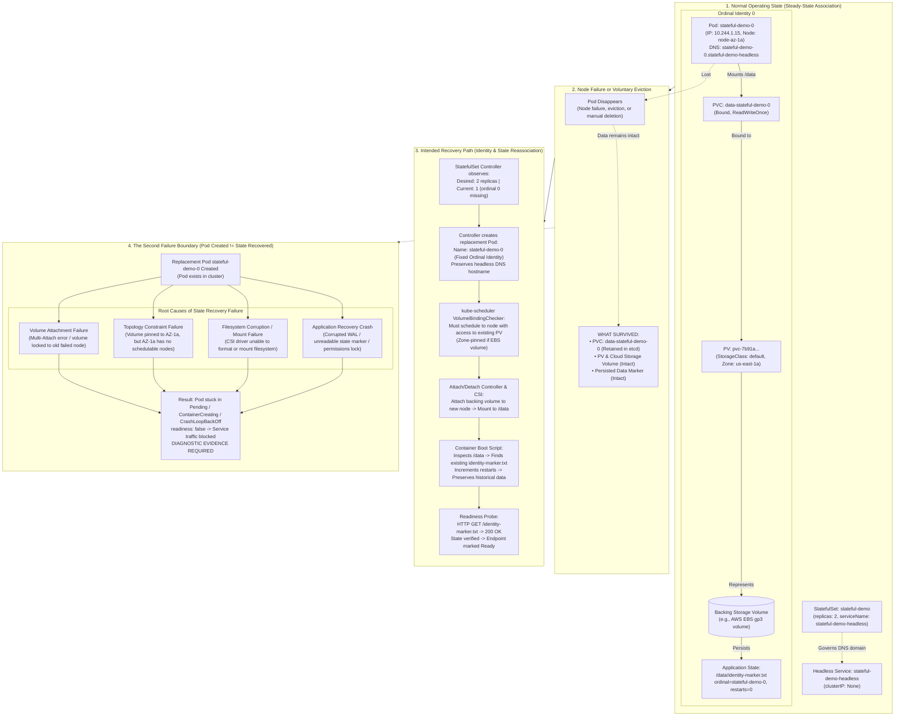

# Stateful Workload Recovery & Identity Architecture

This architecture document visualizes how Kubernetes manages workload identity, network addressing, and persistent storage association during StatefulSet Pod replacement, and models the failure boundaries that emerge when persistent state becomes coupled to compute lifecycles.

Engineering thesis:

$$
\text{Stateless Replica} \longrightarrow \text{Replaceable}
$$

$$
\text{Stateful Replica} \longrightarrow \text{Recoverable (Identity + State)}
$$

> "A stateless replica can often be replaced. A stateful replica may need to be recovered with the correct identity and the correct data."
>
> "Pod replacement is not the same as state recovery."

---

## The Recovery Model: What Survived When the Pod Did Not?

A Pod disappears.

For a stateless workload like `sample-api`, the failure model is straightforward: the Deployment controller observes the missing replica, creates another Pod with an arbitrary random hash identity, schedules it to any node with available compute, and resumes routing once the readiness probe passes.

For a stateful workload, "create another Pod" is not enough. Replicas are not fungible commodities. A stateful replacement requires a coordinated recovery chain:

```text
Pod Ordinal (stateful-demo-0)
      ↓
Network Identity (<pod>.<service>.sample-workloads.svc.cluster.local)
      ↓
PersistentVolumeClaim (data-stateful-demo-0)
      ↓
PersistentVolume / Backing Block Storage (EBS / host / SAN)
      ↓
Node Volume Attachment & Filesystem Mount (/data)
      ↓
Application State Verification & Recovery
      ↓
Readiness Evaluation (Traffic Eligibility)
```

The diagram below contrasts the normal state, the intended recovery path, and the second failure boundary where a replacement Pod exists but state cannot be recovered.

> [!NOTE]
> **Evidence Status: DESIGNED / ILLUSTRATIVE**
> The object names, controller reconciliation steps, and failure boundaries below illustrate Kubernetes StatefulSet and CSI storage semantics. They represent the architectural model implemented by `stateful-demo`.

---

## StatefulSet Identity & Recovery Flow



---

## Architectural Breakdown

### 1. Stable Ordinal Identity vs. Ephemeral Identity

In a stateless `Deployment`, pods are assigned random string suffixes (e.g., `sample-api-7b8f9c6d4b-xk92m`). When a pod is deleted, the replacement receives a completely new random hash (e.g., `sample-api-7b8f9c6d4b-m4t9q`). The two pods share no historical relationship.

In a `StatefulSet`:
- Each pod receives an immutable integer ordinal: `stateful-demo-0`, `stateful-demo-1`.
- When `stateful-demo-0` terminates, the controller strictly creates another pod named `stateful-demo-0`.
- The replacement pod inherits the exact same network identity and PersistentVolumeClaim mapping.

> [!IMPORTANT]
> **Semantic Precision:** The same Pod object does **not** "come back." Pods remain ephemeral, replaceable Kubernetes objects. What survives is the **declared ordinal identity** and the **underlying PersistentVolumeClaim**. The StatefulSet controller guarantees that the replacement pod is granted that identical identity and reassociated with that specific storage claim.

---

### 2. Network Identity via Headless Service

A standard Kubernetes ClusterIP Service provides a virtual load-balancing IP (`VIP`) that routes incoming traffic to any ready pod behind its selector. This abstraction is optimal for stateless replicas, where every pod provides identical functionality.

Stateful workloads require direct, deterministic addressing to individual members:
- A primary database replica must be distinguishable from read-only standby replicas.
- Distributed consensus protocols (Raft, Paxos) require stable peer addresses to maintain quorum.
- Stateful clients may need to route queries directly to the node hosting specific partitioned shards.

Configuring `clusterIP: None` creates a **Headless Service**. CoreDNS provisions deterministic `SRV` and `A` records for each pod:

$$\text{stateful-demo-0}.\text{stateful-demo-headless}.\text{sample-workloads}.\text{svc}.\text{cluster}.\text{local} \longrightarrow \text{Pod 0 IP}$$

$$\text{stateful-demo-1}.\text{stateful-demo-headless}.\text{sample-workloads}.\text{svc}.\text{cluster}.\text{local} \longrightarrow \text{Pod 1 IP}$$

When `stateful-demo-0` is rescheduled to a new node with a different IP address, CoreDNS automatically updates the `A` record for `stateful-demo-0.stateful-demo-headless` to the new IP address. The logical DNS name remains constant.

---

### 3. Storage Coupling & The Topology Boundary

In Milestone #23, we evaluated compute topology: *"Where can the Pod run?"*

Milestone #24 adds a tighter constraint: *"Where can the Pod run AND still access its state?"*

```text
┌────────────────────────────────────────────────────────────────────────┐
│                        Availability Zone: us-east-1a                   │
│                                                                        │
│   Worker Node A                          AWS EBS Volume gp3            │
│   ┌─────────────────────┐                ┌─────────────────────────┐   │
│   │ Pod:                │ ── attaches ── │ PV: pvc-7b91a...        │   │
│   │ stateful-demo-0     │    via CSI     │ (data-stateful-demo-0)  │   │
│   └─────────────────────┘                └─────────────────────────┘   │
└────────────────────────────────────────────────────────────────────────┘
                                    ▲
                                    │ CANNOT ATTACH ACROSS ZONES
                                    ▼
┌────────────────────────────────────────────────────────────────────────┐
│                        Availability Zone: us-east-1b                   │
│                                                                        │
│   Worker Node B                                                        │
│   ┌─────────────────────┐                                              │
│   │ Candidate Node      │ ──X (EBS is physically restricted to 1a)    │
│   └─────────────────────┘                                              │
└────────────────────────────────────────────────────────────────────────┘
```

1. **Zone-Bound Block Storage:** Cloud block storage volumes (such as Amazon EBS) are physically constrained to a single Availability Zone. An EBS volume created in `us-east-1a` cannot be attached to an EC2 instance running in `us-east-1b`.
2. **Scheduler Topology Pinning:** Once a persistent volume is provisioned in Zone A, the `kube-scheduler`'s `VolumeBindingChecker` plugin evaluates the node topology against the volume's `nodeAffinity`. Even if Zone B has abundant idle compute, the scheduler **must** place replacement `stateful-demo-0` onto a node in Zone A.
3. **Volume Binding Modes:**
   - **`VolumeBindingMode: Immediate`:** The PersistentVolume is provisioned as soon as the PVC is created, before any Pod is scheduled. If the provisioner arbitrarily selects Zone B, but the workload has affinity or constraints for Zone A, the Pod is permanently stuck in `Pending`.
   - **`VolumeBindingMode: WaitForFirstConsumer`:** Delays PV provisioning until the Pod is actually scheduled. The scheduler selects an eligible node first (evaluating compute, taints, and topology constraints), and the storage provisioner then creates the volume in the node's specific Availability Zone.

---

### 4. The Two Failure Boundaries of Stateful Workloads

| Failure Boundary | Symptom | What Failed | Diagnostic Location |
| :--- | :--- | :--- | :--- |
| **Boundary 1: Orchestration Failure** | Pod does not schedule or does not appear | Controller unable to reconcile, or scheduler cannot satisfy node resource/topology constraints | `kubectl describe pod` -> `Events` (`FailedScheduling`) |
| **Boundary 2: Storage Recovery Failure** | Pod exists, but remains `ContainerCreating`, `Pending`, or `CrashLoopBackOff` | Volume cannot attach (locked to dead node), cannot mount (filesystem issue), or application crashes during WAL replay | `kubectl describe pod` -> `FailedAttachVolume`, `FailedMount`, or `kubectl logs` |

This distinction drives our entire operational model: **Pod Running $\ne$ State Recovered.**
