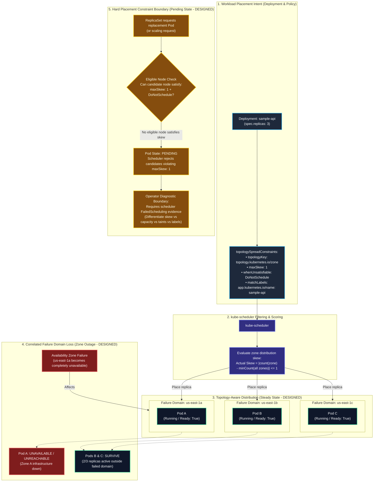

# Multi-AZ Topology Resilience & Failure Domain Architecture

This architecture document visualizes how Kubernetes **Topology Spread Constraints** distribute workload replicas across explicit failure domains (Availability Zones), and models how the system behaves both during a failure domain loss and when hard placement constraints cannot be satisfied.

Engineering thesis:

$$
\text{Replica Count} = \text{Redundancy}
$$

$$
\text{Placement} = \text{Fault Survival}
$$

> "Replica count provides redundancy. Placement determines which failures that redundancy can survive."
> "Design topology against an explicit failure domain—not an abstract idea of high availability."

---

## Topology Placement & Failure Boundary Flow

The following diagram models the complete lifecycle: policy-governed scheduling, survival during a zone failure, and the operational boundary when constraints are unsatisfiable.

> [!NOTE]
> **Evidence Status: DESIGNED / ILLUSTRATIVE**
> The zone placements, pod names, and failure sequences below illustrate designed Kubernetes scheduling semantics and failure domain isolation. They represent intended architecture models rather than live runtime cluster observations.



---

## Architectural Distinctions & Principles

### 1. Correlated Placement Risk vs. Topology Distribution

```text
Without Topology Constraints (Correlated Risk)      With Topology Spread Constraints (Bounded Skew)
==============================================      ==============================================
               Deployment (3 replicas)                             Deployment (3 replicas)
                         │                                                   │
                         ▼                                                   ▼
         ┌───────────────────────────────┐                   ┌───────────────┬───────────────┐
         │     Zone A (Single Domain)    │                   │    Zone A     │    Zone B     │    Zone C     │
         │  Pod A    Pod B    Pod C      │                   │    Pod A      │    Pod B      │    Pod C      │
         └───────────────────────────────┘                   └───────────────┴───────────────┴───────────────┘
                         │                                                   │
                         ▼                                                   ▼
            Zone A Outage = 0/3 Replicas                        Zone A Outage = 2/3 Replicas Survive
```

- **Without explicit topology spread:** Replica count alone does **not** guarantee distribution across the failure domains the application architecture relies upon. The scheduler optimizes for node resource fit, bin-packing, or filtering rules, which can inadvertently co-locate all replicas in a single zone. If that zone experiences an outage, all replicas fail simultaneously despite `replicas: 3`.
- **With topology spread constraints:** Pods matching the selector are actively distributed across eligible topology domains matching `topologyKey: topology.kubernetes.io/zone`, keeping skew $\le 1$.

### 2. Surviving Replicas vs. Application Availability

A critical architectural reality must be highlighted:

$$
\text{Surviving Replicas} \ne \text{Application Availability}
$$

When Zone A fails and Pods B and C survive outside the failed domain:
- **Do NOT claim "66% application availability."**
- Surviving replicas do not automatically guarantee application availability.
- Application availability depends on:
  1. **Remaining compute capacity:** Can 2 surviving replicas handle 100% of production traffic without thread starvation or memory exhaustion?
  2. **Readiness and warm-up:** Are surviving replicas healthy and passing `/ready` checks?
  3. **Data plane & routing:** Have cloud ingress and DNS health checks stopped routing traffic to the failed zone?
  4. **Downstream dependencies:** Are external databases, caches, and storage systems still operational and reachable from Zones B and C?

### 3. The New Failure Boundary: `DoNotSchedule` & Pending Pods

Hard constraints introduce an operational trade-off:

- Setting `whenUnsatisfiable: DoNotSchedule` enforces a strict placement invariant: if placing a pod on an eligible node would result in a skew greater than `maxSkew: 1`, the scheduler will **refuse** to place that pod on that node.
- If no node in any eligible zone can accept the pod while maintaining the skew constraint, the pod remains in the **`Pending`** phase.
- **Do not automatically classify this as "scheduler failure."** The scheduler is functioning exactly as configured, upholding the architectural invariant that correlated failure risk is worse than waiting for eligible capacity.
- Diagnosing a `Pending` pod requires concrete evidence to separate topology skew constraints from node resource exhaustion, taints, missing zone labels, or misconfigured selectors.

---

## Evidence Classification Reference

All claims in this platform adhere to strict evidence standards:

| Classification | Definition in this Platform |
| :--- | :--- |
| **DESIGNED** | Expected system behavior based on architectural design and documented Kubernetes semantics. |
| **STATICALLY VALIDATED** | Configuration schemas, YAML formatting, and semantic rules executed and verified via automated test scripts. |
| **OBSERVED** | Runtime behavior reproduced and asserted against a running Kubernetes cluster with captured logs/events. |
| **SKIPPED** | Optional runtime or environment-specific checks that could not be executed due to missing cluster infrastructure. |
