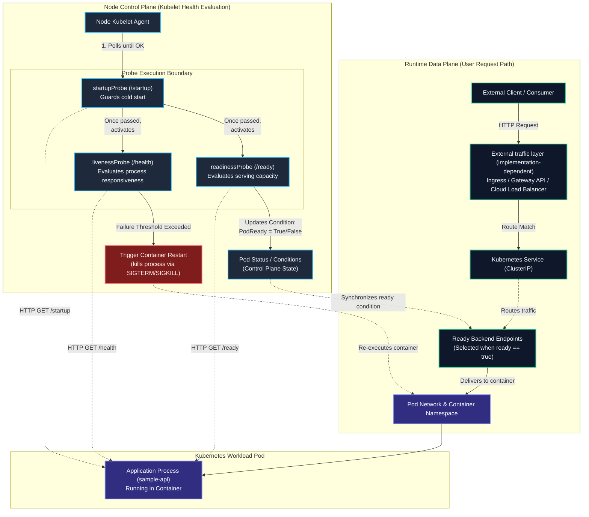

# Workload Health & Traffic Flow Architecture

This diagram illustrates the decoupling between the **Kubernetes Node Control Plane (Health Signals)** and the **Runtime Data Plane (User Traffic Path)**.

A foundational reliability principle in Kubernetes is:

$$
\text{Container Running} \ne \text{Application Ready}
$$

---

## Architecture Flow Diagram

---

## Architectural Distinctions

### 1. Control Plane Signal vs. Runtime Request Path

- **Kubelet is completely isolated from user traffic.** The kubelet acts strictly as an administrative node agent executing health probes on configured intervals via loopback or container network interfaces.
- **The Data Plane relies on endpoint readiness.** Kubernetes Services normally forward client traffic only to backends where endpoint readiness is `true`, while exact forwarding mechanics depend on the underlying data-plane implementation.

### 2. Failure Domain Isolation

| Failure Condition | Evaluated By | Action Taken | Traffic Impact | Container Impact |
| :--- | :--- | :--- | :--- | :--- |
| **Cold start / cache warm-up** | `startupProbe` | Holds off liveness and readiness evaluation | Endpoint marked not ready; no traffic received | Process continues initializing undisturbed |
| **Downstream DB outage / Queue full** | `readinessProbe` | Sets `PodReady = False` | Endpoint marked not ready; traffic bypassed | **No restart**; preserves memory & prevents restart storm |
| **Application deadlock / fatal hang** | `livenessProbe` | Emits `Unhealthy` event to kubelet | Bypassed during container restart | Kubelet terminates and restarts container |

> [!NOTE]
> Kubernetes Services normally use endpoint readiness when determining traffic-eligible backends; exact forwarding behavior depends on the networking/data-plane implementation (e.g., Ingress controllers, AWS Load Balancer Controller, Cilium eBPF, kube-proxy, or service meshes).
