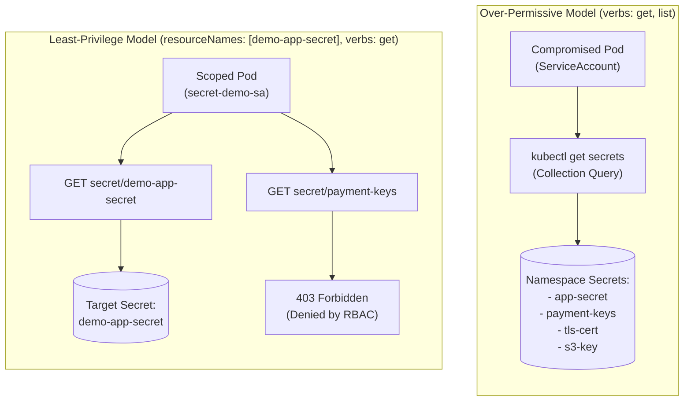

# Failure Scenario 2: Over-Permissive Secret Access & Blast Radius Expansion

## Status: DESIGNED / STATICALLY VALIDATED

> [!NOTE]
> **Evidence Status: DESIGNED / STATICALLY VALIDATED**
> The contrast between over-permissive and least-privilege RBAC policies is statically verified in `scripts/validate.sh`. Command outputs below demonstrate standard Kubernetes API enumeration behavior and are labeled as **ILLUSTRATIVE**.

---

## 1. Situation

A web application running in `sample-workloads` needs to read its database password `demo-app-secret`.

During initial onboarding, an operator writes an unconstrained `Role` to allow the workload to fetch its configuration:

```yaml
# INSECURE OVER-PERMISSIVE PATTERN
apiVersion: rbac.authorization.k8s.io/v1
kind: Role
metadata:
  name: app-secrets-reader
  namespace: sample-workloads
rules:
  - apiGroups: [""]
    resources: ["secrets"]
    verbs: ["get", "list", "watch"]
```

The application functions without any RBAC errors, and the ticket is closed.

---

## 2. Assumption

The platform operator observes:

> *"The Role is scoped to the `sample-workloads` namespace, not the entire cluster. And it only grants read permissions (`get`, `list`, `watch`), not write or delete permissions. This is secure."*

The assumption is that restricting access to a single namespace and read-only verbs provides sufficient isolation.

---

## 3. Hidden Problem

The namespace hosts multiple workloads and infrastructure components, including:
- `demo-app-secret` (the application database password)
- `payment-gateway-credentials` (PCI-scoped payment API tokens)
- `tls-internal-ingress-cert` (internal private TLS keys)
- `backup-s3-service-key` (cloud object store credentials)

Because the Role grants collection-level verbs (`list`, `watch`) without `resourceNames` filtering, the workload identity can dump **every secret in the entire namespace**:

```bash
kubectl get secrets -n sample-workloads \
  --as=system:serviceaccount:sample-workloads:over-permissive-sa
```

*Illustrative Output:*
```text
NAME                          TYPE                DATA   AGE
backup-s3-service-key         Opaque              2      14d
demo-app-secret               Opaque              1      12m
payment-gateway-credentials   Opaque              3      48d
tls-internal-ingress-cert     kubernetes.io/tls   2      90d
```

If a security vulnerability (such as remote code execution, server-side template injection, or arbitrary file read) compromises this single web container, the attacker uses the mounted ServiceAccount token to exfiltrate payment gateway keys, TLS certificates, and backup credentials across the entire namespace.

The blast radius has expanded from a single application password to the entire namespace boundary.

---

## 4. Evidence (Authorization Audit)

Verifying collection-level vs. object-level permissions using `kubectl auth can-i`:

```bash
# Check ability to list all secrets in namespace
kubectl auth can-i list secrets \
  --as=system:serviceaccount:sample-workloads:over-permissive-sa \
  --namespace=sample-workloads
```

*Illustrative Output:*
```text
yes
```

```bash
# Check ability to read unrelated payment credentials
kubectl auth can-i get secret/payment-gateway-credentials \
  --as=system:serviceaccount:sample-workloads:over-permissive-sa \
  --namespace=sample-workloads
```

*Illustrative Output:*
```text
yes
```

The identity has authority to retrieve secrets it was never intended to touch.

---

## 5. Mechanism: Collection Verbs vs. Resource-Name Restriction

Kubernetes RBAC evaluates permissions based on the request type:



### Why `list` Cannot Be Filtered by `resourceNames`
In Kubernetes API semantics:
- A `get` request carries the resource name in the URL: `/api/v1/namespaces/sample-workloads/secrets/demo-app-secret`. The authorizer matches this against `resourceNames: ["demo-app-secret"]`.
- A `list` request targets the resource endpoint: `/api/v1/namespaces/sample-workloads/secrets`. The request does not specify an individual resource name.
- If a Role defines `verbs: ["list"]` with `resourceNames: ["demo-app-secret"]`, any collection query (`kubectl get secrets`) returns **403 Forbidden** because the authorizer cannot evaluate individual item filters during list queries.
- Therefore, granting `list` on secrets invariably opens the entire namespace inventory to inspection.

---

## 6. Resolution: Hardened Least-Privilege RBAC

The hardened pattern adopted in `kubernetes/workloads/secret-demo/role.yaml` eliminates collection-level verbs and enforces exact name targeting:

```yaml
apiVersion: rbac.authorization.k8s.io/v1
kind: Role
metadata:
  name: secret-reader-role
  namespace: sample-workloads
rules:
  - apiGroups: [""]
    resources: ["secrets"]
    resourceNames: ["demo-app-secret"]
    verbs: ["get"]
```

Auditing the hardened identity:

```bash
# 1. Attempt to list all secrets in namespace -> DENIED
kubectl auth can-i list secrets \
  --as=system:serviceaccount:sample-workloads:secret-demo-sa \
  --namespace=sample-workloads
# Output: no

# 2. Attempt to get target secret -> ALLOWED
kubectl auth can-i get secret/demo-app-secret \
  --as=system:serviceaccount:sample-workloads:secret-demo-sa \
  --namespace=sample-workloads
# Output: yes

# 3. Attempt to get unrelated secret -> DENIED
kubectl auth can-i get secret/payment-gateway-credentials \
  --as=system:serviceaccount:sample-workloads:secret-demo-sa \
  --namespace=sample-workloads
# Output: no
```

The blast radius is strictly contained to `demo-app-secret`.

---

## 7. Trade-off & Engineering Judgment

### The Trade-off
- **Broad `list` / `watch`:** Simplifies microservice development where workloads dynamically discover multiple configuration objects. However, it violates least privilege and exposes unrelated secrets to lateral movement.
- **Strict `resourceNames` with `get`:** Eliminates lateral secret exfiltration, but requires operators or GitOps automation to maintain discrete Roles or RoleBindings for each sensitive workload.

### Engineering Judgment
Secret confidentiality is an authorization problem, not a representation problem. Base64 encoding does not stop an attacker from reading an exposed Secret; strict RBAC verb and `resourceNames` filtering does.
