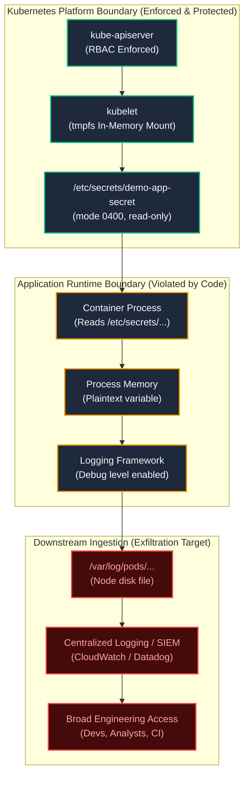

# Failure Scenario 3: Secret Leakage Outside Kubernetes

## Status: DESIGNED / STATICALLY VALIDATED

> [!NOTE]
> **Evidence Status: DESIGNED / STATICALLY VALIDATED**
> Workload manifest configurations and volume mount permissions are verified in `scripts/validate.sh`. Application logs and debug outputs below illustrate runtime leakage boundaries and are labeled as **ILLUSTRATIVE**.

---

## 1. Situation

A backend service consumes its database password `demo-app-secret` through an in-memory volume mount at `/etc/secrets/demo-app-secret/password`.

The cluster enforces least-privilege RBAC, etcd access is restricted, the Pod runs with a non-root user (`runAsUser: 10001`), and the volume file permissions are set to `0400` (`readOnly: true`).

The application starts successfully:

```bash
kubectl get pods -n sample-workloads -l app.kubernetes.io/name=secret-demo
```

*Illustrative Output:*
```text
NAME                           READY   STATUS    RESTARTS   AGE
secret-demo-59db946c59-p4l2x   1/1     Running   0          3m
```

---

## 2. Assumption

The platform operator observes:

> *"The Kubernetes Secret object is isolated by RBAC, mounted on an in-memory tmpfs filesystem, and marked read-only. The credential cannot leak."*

The assumption is that securing the Kubernetes delivery pipeline guarantees confidentiality of the credential during execution.

---

## 3. Hidden Problem

During startup or exception handling, application runtime code executes an un-sanitized logging statement or debug dump.

For example, when an upstream database connection times out, an unhandled exception or debug interceptor outputs the full connection URI:

```bash
kubectl logs secret-demo-59db946c59-p4l2x -n sample-workloads
```

*Illustrative Unsanitized Log Output (UNSAFE PATTERN):*
```text
2026-10-08T00:15:22.102Z [DEBUG] Initializing PostgreSQL connection pool...
2026-10-08T00:15:24.301Z [ERROR] Failed to connect to db.internal:5432: connection timeout.
2026-10-08T00:15:24.302Z [DEBUG] Connection config: {host: db.internal, port: 5432, user: app_admin, password: <DEMO_SECRET_VALUE>} # Never commit or log credentials
```

Even though Kubernetes enforced every cluster-side boundary:
1. The logging daemon (Fluentbit / Vector) reads the container's stdout log file from `/var/log/pods/`.
2. The log entry is ingested into an external log aggregator (CloudWatch, Datadog, Elasticsearch).
3. The credential is now indexed, searchable, and accessible to anyone with view access to the application log dashboard.
4. The credential persists indefinitely in cold log archives and backups.

---

## 4. Evidence (Leakage Trace Audit)

Auditing the centralized log stream for credential patterns:

```bash
# Illustrative query scanning container logs for credential assignment strings
kubectl logs -n sample-workloads -l app.kubernetes.io/name=secret-demo --tail=100 | grep -iE 'password|passwd|token'
```

*Illustrative Output:*
```text
[DEBUG] Connection config: {host: db.internal, port: 5432, user: app_admin, password: <DEMO_SECRET_VALUE>} # Never commit or log credentials
```

The Secret was safely delivered to the pod, but immediately exfiltrated across the application boundary.

---

## 5. Mechanism: The Application Runtime Boundary



### Downstream Leakage Channels
1. **stdout / stderr Streams:** Default logging capturing config objects, request payloads, or stack traces.
2. **Process Environment (`/proc/$PID/environ`):** If environment variable delivery is chosen instead of volume mounts, any local process running as the same UID can dump the environment table.
3. **Crash / APM Dumps:** Application crash reporters (e.g., Sentry) capturing local stack frame state and local variables upon uncaught exceptions.
4. **Diagnostic Endpoints:** Internal endpoints (e.g., `/env`, `/metrics`, `/debug/pprof`) exposing runtime configuration.

---

## 6. Resolution: Application-Side Defense in Depth

Kubernetes cannot rewrite bad application code. Protecting the application runtime boundary requires engineering discipline within the service:

### 1. Workload Fingerprint Logging (Reference Pattern)
In `kubernetes/workloads/secret-demo/deployment.yaml`, the reference container verifies credential delivery without outputting the secret value:

```sh
# SAFE PATTERN: Output metadata and cryptographic hash prefix only
SECRET_FILE="/etc/secrets/demo-app-secret/password"
if [ -f "$SECRET_FILE" ]; then
  FILE_SIZE=$(wc -c < "$SECRET_FILE" | tr -d ' ')
  FILE_PERMS=$(ls -l "$SECRET_FILE" | awk '{print $1}')
  FINGERPRINT=$(sha256sum "$SECRET_FILE" | cut -c1-8)
  echo "Secret volume active. Mode: ${FILE_PERMS}, Size: ${FILE_SIZE}B, Fingerprint: ${FINGERPRINT}..., Health: OK"
fi
```

*Safe Operational Output:*
```text
Secret volume active. Mode: -r--------, Size: 18B, Fingerprint: e3b0c442..., Health: OK
```

### 2. Runtime Sanitization
- Explicitly mask credentials in application log formatters (`password: [REDACTED]`).
- Disable debug-level verbosity in production container images.
- Strip sensitive query parameters and authorization headers in HTTP middleware.

---

## 7. Trade-off & Engineering Judgment

### The Trade-off
- **Logging Full Config Objects:** Accelerates local development and triage by making every variable immediately visible during connection failures, but creates massive exposure in production logs.
- **Strict Redaction & Fingerprinting:** Protects credential confidentiality in downstream telemetry, but requires developers to diagnose connection issues using synthetic health checks and metadata rather than raw strings.

### Engineering Judgment
Kubernetes security ends at the container filesystem. The platform can ensure only authorized pods mount a secret, but platform controls cannot prevent application code from printing that secret to stdout. Confidentiality requires end-to-end discipline across both infrastructure and application layers.
