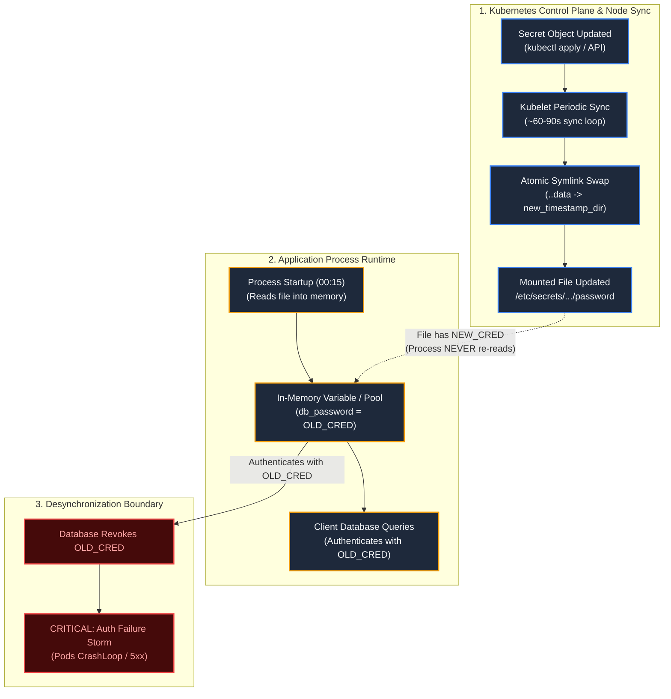

# Failure Scenario 4: Secret Rotation Lifecycle Boundary

## Status: DESIGNED / STATICALLY VALIDATED

> [!NOTE]
> **Evidence Status: DESIGNED / STATICALLY VALIDATED**
> The contrast between filesystem projection updates and in-memory process caching is statically verified in `scripts/validate.sh`. Command outputs below demonstrate standard kubelet volume rotation semantics and are labeled as **ILLUSTRATIVE**.

---

## 1. Situation

A production database password `demo-app-secret` is scheduled for routine quarterly rotation.

An engineer or automated pipeline updates the Secret object in the Kubernetes API with the new credential:

```bash
kubectl create secret generic demo-app-secret \
  --namespace=sample-workloads \
  --from-literal=password=<NEW_ROTATED_SECRET_VALUE> \
  --dry-run=client -o yaml | kubectl apply -f -
```

The database administrator revokes the old password on the database server.

---

## 2. Assumption

The platform operator observes:

> *"The Secret object was successfully updated in Kubernetes. Kubelet automatically updates mounted secret volumes. The application is now using the new password."*

The assumption is that when Kubernetes updates the Secret object, the running application process immediately and automatically begins authenticating with the new credential.

---

## 3. Hidden Problem

Within minutes of revoking the old password, the database server triggers hundreds of authentication rejections, and the application begins failing all client requests:

```bash
kubectl logs -n sample-workloads -l app.kubernetes.io/name=secret-demo --tail=10
```

*Illustrative Output:*
```text
[ERROR] Database connection failed: FATAL: password authentication failed for user "app_admin"
[ERROR] Retrying connection in 5s...
[ERROR] Database connection failed: FATAL: password authentication failed for user "app_admin"
```

Yet, if an operator execs into the container and checks the mounted secret file on disk:

```bash
kubectl exec -it -n sample-workloads deploy/secret-demo -- cat /etc/secrets/demo-app-secret/password
```

*Illustrative Output:*
```text
<NEW_ROTATED_SECRET_VALUE>
```

The file on disk **has** been updated to the new password! Why is the application failing?

---

## 4. Evidence: Filesystem vs. Memory Desynchronization

To understand why the application fails despite the file being updated, we inspect the container filesystem projection:

```bash
kubectl exec -it -n sample-workloads deploy/secret-demo -- ls -la /etc/secrets/demo-app-secret
```

*Illustrative Output:*
```text
total 0
drwxrwxrwt 3 root root 100 Oct  8 00:20 .
drwxr-xr-x 3 root root  40 Oct  8 00:15 ..
drwxr-xr-x 2 root root  60 Oct  8 00:20 ..2026_10_08_00_20_14.839129481
lrwxrwxrwx 1 root root  31 Oct  8 00:20 ..data -> ..2026_10_08_00_20_14.839129481
lrwxrwxrwx 1 root root  15 Oct  8 00:15 password -> ..data/password
```

Kubelet executed an atomic symlink swap:
1. Created new directory `..2026_10_08_00_20_14.839129481`.
2. Wrote the new password into `..2026_10_08_00_20_14.839129481/password`.
3. Updated the symlink `..data` to point to the new directory.

**The Failure:** The application process read the file once into an in-memory connection pool configuration when the container booted at `00:15`. It never registered an `inotify` watcher on `/etc/secrets/demo-app-secret/password`. The long-lived database connection pool in memory continues attempting to reconnect using the old, revoked password cached in the application's RAM.

---

## 5. Mechanism: The Secret Rotation Chain



### Rotation Behavior Across Delivery Models

| Delivery Model | Filesystem Update | Process Memory Update | Required Operator Action |
| :--- | :--- | :--- | :--- |
| **Volume Mount (Standard)** | Automatic (Kubelet sync loop, usually 60–90 seconds via atomic symlink swap). | **Stale.** Process does not reload unless application implements `inotify` / file watching. | Restart pods via `kubectl rollout restart deployment/<name>`. |
| **Environment Variable** | **None.** Container environment is immutable after `execve()`. | **Stale.** Process cannot observe updated environment variable. | Restart pods via `kubectl rollout restart deployment/<name>`. |
| **Immutable Secret (`immutable: true`)** | **Prohibited.** Secret cannot be modified in place. | **N/A.** | Create `secret-v2`, update Deployment manifest to point to `secret-v2`, trigger rolling rollout. |

---

## 6. Resolution: Safe Rotation Strategies

To avoid the in-memory staleness trap, platform teams adopt one of three patterns:

### Strategy 1: Controlled Rolling Restart (Recommended Baseline)
Whenever a Secret is updated, trigger a rolling deployment rollout:

```bash
kubectl rollout restart deployment/secret-demo -n sample-workloads
```

This guarantees:
1. Replacement pods mount the updated secret directory at startup.
2. The readiness probe verifies connectivity before the old replica is terminated.
3. Zero in-memory staleness occurs.

### Strategy 2: In-Process Reloaders / File Watchers
For services that cannot tolerate restarts:
- Use an `inotify` file watcher inside the application process that detects changes to `/etc/secrets/demo-app-secret/..data`.
- Trigger an internal connection pool refresh without terminating the HTTP server.

### Strategy 3: Versioned Immutable Secrets
- Deploy `demo-app-secret-v2`.
- Update `deployment.yaml` `volumes[0].secret.secretName: demo-app-secret-v2`.
- GitOps / CI triggers a declarative rollout.

---

## 7. Trade-off & Engineering Judgment

### The Trade-off
- **Relying on Kubelet Automatic Volume Updates:** Avoids restarting pods, but risks silent desynchronization where the filesystem has the new credential while application RAM holds the old one.
- **Enforcing Deployment Rollouts on Rotation:** Incurs the compute overhead of cycling pods and re-evaluating readiness probes, but provides deterministic, verifiable guarantees that every running process is using the new credential.

### Engineering Judgment
Updating a Secret in Kubernetes only updates the storage layer; it does not update running application memory. In production, never assume a credential rotation is complete until every consuming Pod replica has been verified against the new credential.
