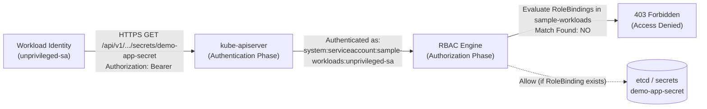

# Failure Scenario 1: Unauthorized Secret Access

## Status: DESIGNED / STATICALLY VALIDATED

> [!NOTE]
> **Evidence Status: DESIGNED / STATICALLY VALIDATED**
> The RBAC definitions and ServiceAccount bindings are validated locally in `scripts/validate.sh`. API responses and `kubectl auth can-i` command outputs below represent standard Kubernetes RBAC authorization semantics and are labeled as **ILLUSTRATIVE**.

---

## 1. Situation

A workload running in the `sample-workloads` namespace needs to query a database credential directly from the Kubernetes API server using an in-cluster client or SDK.

*(Note: Workloads consuming credentials via projected Secret volumes or environment variables do not use ServiceAccount RBAC for retrieval; the kubelet fetches them via node-level credentials. ServiceAccount RBAC governs direct API interactions.)*

An operator configures the Pod to run with an unprivileged ServiceAccount:

```bash
kubectl get pod secret-demo-79df495fc9-v7zqx -n sample-workloads -o jsonpath='{.spec.serviceAccountName}'
```

*Illustrative Output:*
```text
unprivileged-sa
```

The workload process or an automation script executed within the container requests the Secret from the Kubernetes API server using the in-cluster service account token:

```bash
curl -sSk -H "Authorization: Bearer $(cat /var/run/secrets/kubernetes.io/serviceaccount/token)" \
  https://kubernetes.default.svc/api/v1/namespaces/sample-workloads/secrets/demo-app-secret
```

---

## 2. Assumption

The platform operator observes:

> *"The workload is running in the same namespace as the Secret, and it has an active ServiceAccount token mounted. Kubernetes should allow it to access resources within its own namespace."*

The assumption is that namespace residency confers default read permissions to in-cluster workloads.

---

## 3. Hidden Problem

The API request is rejected immediately with **HTTP 403 Forbidden**:

```json
{
  "kind": "Status",
  "apiVersion": "v1",
  "metadata": {},
  "status": "Failure",
  "message": "secrets \"demo-app-secret\" is forbidden: User \"system:serviceaccount:sample-workloads:unprivileged-sa\" cannot get resource \"secrets\" in API group \"\" in the namespace \"sample-workloads\"",
  "reason": "Forbidden",
  "details": {
    "name": "demo-app-secret",
    "kind": "secrets"
  },
  "code": 403
}
```

By default in Kubernetes, a newly created ServiceAccount has **zero permissions** to read API resources. While `automountServiceAccountToken: true` injects a valid JWT into the container filesystem, that token only authenticates the caller's identity (`system:serviceaccount:sample-workloads:unprivileged-sa`). It grants no authorization.

Without an explicit `Role` and `RoleBinding`, the Kubernetes RBAC engine denies all requests to read `secrets`.

---

## 4. Evidence (Diagnostic Walkthrough)

To verify whether an identity has permission to retrieve a secret without modifying application code, an operator evaluates the authorization engine directly:

```bash
kubectl auth can-i get secret/demo-app-secret \
  --as=system:serviceaccount:sample-workloads:unprivileged-sa \
  --namespace=sample-workloads
```

*Illustrative Output:*
```text
no
```

Inspecting the role bindings for this ServiceAccount in the namespace confirms that no binding targets the identity:

```bash
kubectl get rolebindings -n sample-workloads -o wide
```

*Illustrative Output:*
```text
NAME                     ROLE                      AGE   USERS   GROUPS   SERVICEACCOUNTS
secret-reader-binding    Role/secret-reader-role   20m                    sample-workloads/secret-demo-sa
```

The binding targets `secret-demo-sa`, not `unprivileged-sa`.

---

## 5. Mechanism



The Kubernetes API server processes requests in strict sequence:
1. **Authentication:** Validates the bearer token signature against the cluster's service account issuer keys. Identity confirmed: `system:serviceaccount:sample-workloads:unprivileged-sa`.
2. **Authorization (RBAC):** Queries all `RoleBindings` in `sample-workloads` where the subject matches the authenticated user. If no `Role` grants verb `get` on resource `secrets`, the authorizer defaults to deny (`Decision: Deny`).
3. **Admission & Processing:** Because authorization failed, the request is terminated before reaching storage or admission webhooks.

### The Dual-Track Secret Access Model
It is essential to distinguish between two completely different mechanisms by which secrets reach code:

| Dimension | Track 1: Projected Volume Mount (`spec.volumes[].secret`) | Track 2: Direct API Query (`curl` / Kubernetes Client SDK) |
| :--- | :--- | :--- |
| **Requesting Entity** | `kubelet` daemon on the worker node. | Application process inside the running container. |
| **Identity Used** | Node identity (`system:node:<nodename>`). | Workload ServiceAccount (`system:serviceaccount:...`). |
| **Authorization Check** | Node Authorizer validates that the Pod is scheduled on this node. | RBAC authorizer evaluates ServiceAccount Roles and RoleBindings. |
| **Pod SA RBAC Needed?** | **NO.** The Pod's `serviceAccountName` requires zero Secret RBAC. | **YES.** Requires explicit `Role` granting `get` on the Secret. |

---

## 6. Resolution: Least-Privilege Scoping

To resolve direct API authorization failures safely:
1. Assign the designated ServiceAccount `secret-demo-sa` to the workload.
2. Bind `secret-demo-sa` to a strictly scoped `Role` targeting `demo-app-secret` with verb `get`:

```yaml
apiVersion: rbac.authorization.k8s.io/v1
kind: Role
metadata:
  name: secret-reader-role
  namespace: sample-workloads
rules:
  - apiGroups: [""]
    resources: ["secrets"]
    resourceNames: ["demo-app-secret"]
    verbs: ["get"]
```

Re-verifying with `kubectl auth can-i`:

```bash
kubectl auth can-i get secret/demo-app-secret \
  --as=system:serviceaccount:sample-workloads:secret-demo-sa \
  --namespace=sample-workloads
```

*Illustrative Output:*
```text
yes
```

---

## 7. The Indirect Secret Access Boundary: Workload Creation vs. Direct Secret API

A common security misconception is:

> *"If `kubectl auth can-i get secrets --as=developer` returns `no`, that user cannot read secret values in the namespace."*

This assumption is **dangerously false**.

### The Indirect Escalation Vector
If a user lacks direct API access to `secrets`, but holds permission to create or modify workloads (`pods/create`, `deployments/create`, or `jobs/create`), they can mount the Secret into an arbitrary Pod and read its contents:

```yaml
# Credential-extraction pod submitted by user lacking 'secrets' RBAC
apiVersion: v1
kind: Pod
metadata:
  name: indirect-secret-extractor
  namespace: sample-workloads
spec:
  restartPolicy: Never
  containers:
    - name: extractor
      image: busybox:1.36.1
      command: ["/bin/sh", "-c", "cat /etc/secret-volume/password"]
      volumeMounts:
        - name: extracted-secret
          mountPath: /etc/secret-volume
          readOnly: true
  volumes:
    - name: extracted-secret
      secret:
        secretName: demo-app-secret
```

Once scheduled:
1. The kubelet mounts `demo-app-secret` into the container because the user is authorized to create Pods, and kubelet handles volume retrieval.
2. The user executes `kubectl logs indirect-secret-extractor -n sample-workloads` or `kubectl exec` to retrieve the plaintext credential.

### The Five Layers of Secret Access Defense
True secret confidentiality requires evaluating the full stack of controls:

1. **Direct Secret API Access:** Constrained by RBAC (`get` on `secrets`).
2. **Workload Mutation Permissions:** Restricting `pods/create`, `deployments/create`, `jobs/create`, and `pods/exec`.
3. **Admission Policies:** Validating admission controllers (e.g., Kyverno, OPA/Gatekeeper, or Pod Security Standards) restricting which pods may reference specific secrets or volume types.
4. **Secret References in Pod Specs:** Auditing declarative manifests in CI/CD before deployment.
5. **Runtime Container Isolation:** Preventing interactive debugging (`exec`) and enforcing non-root, read-only root filesystems.

---

## 8. Trade-off & Engineering Judgment

### The Trade-off
- **Granting Broad Role (`resources: ["secrets"]`, `verbs: ["*"]`):** Eliminates 403 errors permanently and requires zero configuration changes when new secrets are added, but drastically expands the blast radius across the namespace.
- **Granting Granular Role (`resourceNames: ["demo-app-secret"]`, `verbs: ["get"]`):** Enforces strict least privilege for API clients, but requires explicit RBAC updates whenever a workload's secret dependency changes.

### Engineering Judgment
Never grant cluster-wide or namespace-wide secret read permissions to application workloads. Every workload identity must be bounded to the exact Secret resource it requires to function. Furthermore, never treat a negative `kubectl auth can-i get secret` as proof of isolation: if an identity can run containers in a namespace, it can indirectly access that namespace's mounted secrets unless admission webhooks explicitly forbid it.
